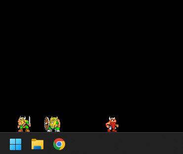
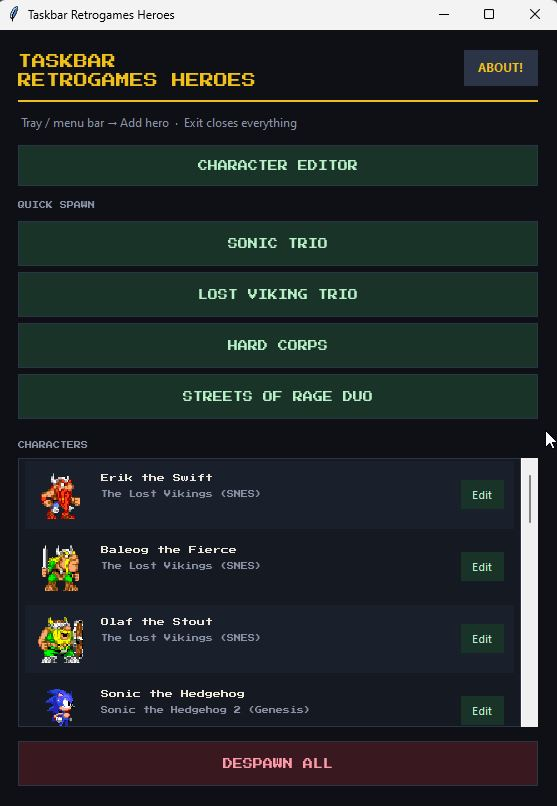
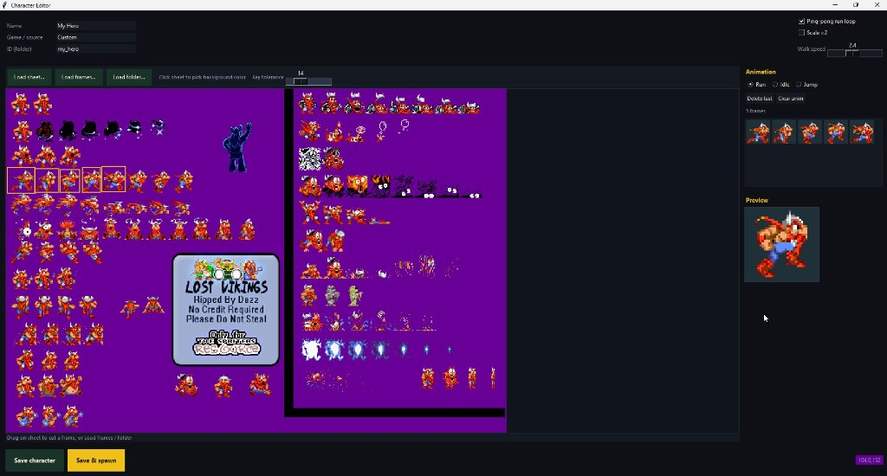

<p align="center">
  
</p>

<h1 align="center">Taskbar Retrogames Heroes</h1>

<p align="center">
  <em>Retro game characters that walk on your taskbar / Dock / panel</em>
</p>

<p align="center">
  <a href="#download">Download</a> ·
  <a href="#features">Features</a> ·
  <a href="#sprites--license">Free &amp; sprites</a> ·
  <a href="https://t.me/gamebase54">Telegram</a> ·
  <a href="https://github.com/Carter54git">GitHub</a>
</p>

---

## What is this?

A lightweight desktop toy: pixel heroes from classic games **run, jump, and idle** right on your Windows taskbar (and on the Dock / panel on macOS and Linux).

No system installer, no ads, no payment — **the program is completely free**.

<p align="center">
  
</p>

---

## Features

- **Taskbar as a stage** — heroes walk on top of the taskbar / Dock
- **Quick spawn** — Sonic Trio, Lost Vikings, Hard Corps, Streets of Rage
- **Character editor** — cut frames from a sprite sheet and save your own hero
- **Tray / menu bar** — add heroes, open settings, despawn all, About
- **Cross-platform** — Windows, macOS, Linux

<p align="center">
  
</p>

---

## Download

| Platform | File |
|----------|------|
| **Windows x64** | [`downloads/TaskbarRetrogamesHeroes-windows-x64.zip`](downloads/TaskbarRetrogamesHeroes-windows-x64.zip) |

1. Unzip the archive  
2. Run `TaskbarRetrogamesHeroes.exe`  
3. Use the tray icon to add heroes  

> macOS / Linux: build from source (`build_unix.sh` / `run_heroes.sh` in the project repo).

---

## Roster

| Series | Heroes |
|--------|--------|
| **Lost Vikings** | Erik · Baleog · Olaf |
| **Sonic** | Sonic · Tails · Knuckles |
| **Contra** | Ray · Sheena · Fang · Browny · Bill |
| **Streets of Rage** | Axel · Blaze |
| **More** | Kirby · Earthworm Jim · Sketch Turner · Mario · Samus |

Create your own hero in the **Character Editor** — Load sheet / frames / folder.

---

## Controls

| Action | How |
|--------|-----|
| Jump | Left-click hero / Space |
| Turn around | Double-click |
| Context menu | Right-click (on Mac: Ctrl+click) |
| Pause / charge / switch | Hero context menu |
| Settings | Click the tray icon |

---

## Sprites & license

### The app is free

This application is **completely free** (freeware / MIT):

- use it at no cost  
- share it with friends  
- build it from source  

See [`LICENSE`](LICENSE).

### Sprites from open sources

Bundled sprites were taken from **public / open community sources** for retro games (including archives such as [The Spriters Resource](https://www.spriters-resource.com/) and similar).

- We do **not** claim ownership of any character or artwork  
- Games, publishers, and artists remain the rights holders  
- This project is a non-commercial fan desktop toy  

Details: [`CREDITS.md`](CREDITS.md).

---

## Links

- Telegram: [t.me/gamebase54](https://t.me/gamebase54)  
- GitHub: [github.com/Carter54git](https://github.com/Carter54git)  

---

## From source

```bash
pip install -r requirements.txt
python launcher.py          # Windows / any
# or
./run_heroes.sh             # macOS / Linux
```

Windows build: `build_exe.bat` → `dist/TaskbarRetrogamesHeroes/`  
Unix build: `./build_unix.sh`

If heroes sit at the wrong height: `set HEROES_GROUND_Y=1050` (Y of the top edge of the panel).

---

<p align="center">
  <sub>Made for fun · Free forever · Retro forever</sub><br>
  <sub>Sprites belong to their original owners · app code MIT</sub>
</p>
